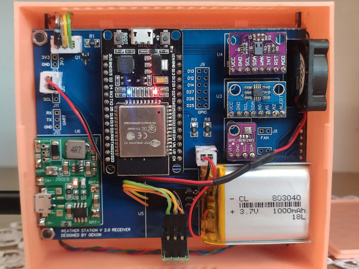
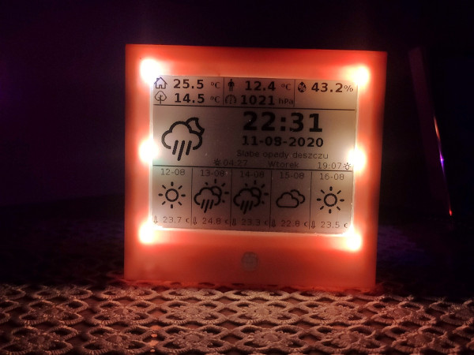

## Epaper Weather Station Receiver


### 1. Introduction

The project is a part of bigger IOT system. Weather Station receiver measures basic parameters, such as temperature, pressure, humidity, but also CO2, TVOC level. Other parameters, like outside temperature, weather forecast can be received by MQTT and displayed on 4.2" Epaper display.


### 2. Features

- 4.2" E-paper display with additional NeoPixel backlight
- Li-Ion battery as backup PS
- Additional fan for better air flow
- Temperature, humidity, pressure measurements
- CO<sub>2</sub>, TVOC level measurements
- PIR sensor
- Time, date, sunrise/sunset time display
- Current weather forecast with description
- Weather forecast for next 5 days
- Outside temperature, felt temperature display
- All displayed parameters/icons can be easily changed
- All not measured parameters are send to/from weather station by MQTT


### 3. Bill of Materials

Main components:

| Device  		    | Description 	                          | Price		  | 
| --------------- | --------------------------------------- |-----------|
| ESP32 DEVKIT V1 | Main IC                                 |	$3.50     |
| BME280          | Temperature, humidity, pressure sensor  |	$2.10     |
| MCP9808         | High accuracy temperature sensor        | $0.75     |
| CCS811          | CO<sub>2</sub>, TVOC sensor                        | $5.89     |
| HC-SR505        | PIR sensor (AM312)                      | $1.15     |
| J5019           | Battery charger with DC-DC converter    | $0.69     |
| 4.2" Epaper     | Waveshare E-paper Display Module        | $28.47    |
| 25mm fan        | 5V fan (25x25x7mm)                      | $1.22     |
| SK6812          | RGBW NeoPixel LED                       | $0.25     |
| 1000mAh Li-Ion  | Battery                                 | $2.50     |
| PCB             | Custom PCB                              |           |
| Housing         | Custom housing (3D printed)             |           |


### 4. Libraries

- [GxEPD](https://github.com/ZinggJM/GxEPD "GxEPD")
- [Adafruit GFX](https://github.com/adafruit/Adafruit-GFX-Library "Adafruit_GFX")
- [PubSubClient](https://github.com/knolleary/pubsubclient "PubSubClient")
- [ArduinoJson](https://github.com/bblanchon/ArduinoJson "ArduinoJsonD")
- [Adafruit MCP9808](https://github.com/adafruit/Adafruit_MCP9808_Library "Adafruit_MCP9808")
- [Adafruit BME280](https://github.com/adafruit/Adafruit_BME280_Library "Adafruit_BME280")
- [Adafruit Sensor](https://github.com/adafruit/Adafruit_Sensor "Adafruit_Sensor")
- [Adafruit CCS811](https://github.com/adafruit/Adafruit_CCS811 "Adafruit_CCS811")
- [Adafruit NeoPixel](https://github.com/adafruit/Adafruit_NeoPixel "Adafruit_NeoPixel")


### 5. Getting Started

To run Weather Station, user should change some settings in data.h file:

Basic WiFi settings
```
// WiFi Settings
const char* ssid = "YOUR_SSID";
const char* password = "YOUR_PASSWORD";
```

Choose, how many NeoPixel LEDs you want to use. You can solder up to 10 LEDs. If you use less than 10, you should make shorts everywhere, where you do not use LEDs (Designators R2 to R7)
```
// NeoPixel settings
 ...
#define LED_COUNT   6       // No of LEDs
```

Uncomment, if you use MQTT user and password
```
// MQTT Settings
const char* mqtt_server = "MQTT_SERVER_IP";
//const char* mqtt_user = "MQTT_USER";
//const char* mqtt_password = "MQTT_PASSWORD";
```

You can adjust, how often display will be refreshed, and how often presence will be checked using PIR sensor (it also defines minimum backlight time)
```
// Refresh time in seconds
#define REFRESH_TIME	30
#define PRESENCE_TIME   5
```

Define altitude of your home (for pressure measurements)
```
// Sensors config data
#define ALTITUDE        515.0 //define altitude of location
```

Define MQTT Publish and Subscribe topics compatible with your server
```
// MQTT Input topics
#define TEMPOUT_TOPIC       "home/weatherstation/tempout"
#define TIME_TOPIC          "basic/time/time"
#define DATE_TOPIC          "basic/time/date"
#define SUNRISE_TOPIC       "conditions/weather/sunrise"
#define SUNSET_TOPIC        "conditions/weather/sunset"
#define DESCRIPTION_TOPIC   "conditions/weather/description"
#define WEEKDAY_TOPIC       "basic/time/day"
#define WEATHER_ICON_TOPIC  "conditions/weather/icon"
#define FELT_TEMP_TOPIC     "conditions/weather/tempfeel"
#define FORECAST1_TOPIC     "forecast1"
#define FORECAST2_TOPIC     "forecast2"
#define FORECAST3_TOPIC     "forecast3"
#define FORECAST4_TOPIC     "forecast4"
#define FORECAST5_TOPIC     "forecast5"

// MQTT Output topics
#define PUBLISH_TOPIC       "home/station"
```

### 6. Description

The main functionality of Weather Station is to measure inside conditions and display parameters on Epaper display.

#### Measurements
- <b>Temperature:</b> measured by MCP9808 to ensure high accuracy (0,25&ordm;C)
- <b>Humidity, Pressure:</b> measured by BME280
- <b>CO<sub>2</sub>, TVOC:</b> measured by CCS811
- <b>Presence:</b> measured by HC-SR505 PIR sensor, used to detect presence and to switch ON backlight
- <b>Other:</b> battery voltage can be measured using analog input (<b>NOT IMPLEMENTED</b>)

#### Display

Not all measured parameters are displayed on Epaper. I use only few most important indicators.


<b>A</b> Temperature inside (measured)<br>
<b>B</b> Temperature outside (MQTT)<br>
<b>C</b> Felt temperature (MQTT)<br>
<b>D</b> Pressure inside (measured)<br>
<b>E</b> Humidity inside (measured)<br>
<b>F</b> Empty space, to be used<br>
<b>G</b> Actual weather icon (MQTT)<br>
<b>H</b> Time (MQTT)<br>
<b>I</b> Date (MQTT)<br>
<b>J</b> Weather description (MQTT)<br>
<b>K</b> Sunrise time (MQTT)<br>
<b>L</b> Day of week (MQTT)<br>
<b>M</b> Sunset (MQTT)<br>
<b>N</b> Forecast date (MQTT)<br>
<b>O</b> Forecast icon (MQTT)<br>
<b>P</b> Forecast temperature (MQTT)

#### Input parameters

All MQTT subscribed topics should provide data in format:


| Topic  		  	| Type			                        | Example	  		| Note				|
| --------------- 	| --------------------------------------|-------------		|-------------		|
| TEMPOUT_TOPIC		| String								| 30.75				|					|
| TIME_TOPIC		| String								| 10:02				|					|
| DATE_TOPIC		| String								| 12-08-2020		|					|
| SUNRISE_TOPIC		| String								| 04:29				|					|
| SUNSET_TOPIC		| String								| 19:06				|					|
| DESCRIPTION_TOPIC	| String								| Sunny				|					|
| WEEKDAY_TOPIC		| String								| Monday			|					|
| WEATHER_ICON_TOPIC| String								| 1					| See picture below	|
| FELT_TEMP_TOPIC	| String								| 31.56				|					|
| FORECASTx_TOPIC	| JSON									| See example below |					|

Weather Icons codes

Forecast JSON example
```json
{
"time1":"12-08",
"icon1":"1",
"temp1":22.23
}
```


#### Output parameters

### 7. Changelog

2020-08-11 <b>V0.1</b> First Beta Release - not optimized


### 8. Task list

- Software:
- [ ] Firmware code optimization
- [ ] Service commands (e.g. for temperature calibration)
- [ ] RTC support to keep date/time
- [ ] Battery voltage measurements
- [ ] WiFi manager with input settings

- Hardware:
- [ ] Change NeoPixel data MOSFET to AND gate


## 9. Pictures




