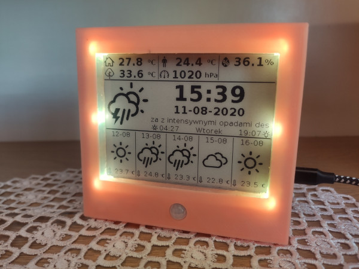

## Testowe

### Introduction

The project was...

### Features

- Temperature, humidity, pressure measurements;
- Time, date display;
-  

### Bill of Materials

| Device  		| Description 	| Price		| 
| ------------- | ------------- |-----------|
| Content Cell  | Content Cell  |			|
| Content Cell  | Content Cell  |			|

### Libraries used

- Arduino JSON
- BME280

### Getting Started

### Description

### Changelog

### Task list

test

