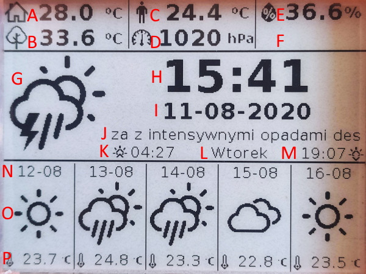

## Epaper Weather Station Receiver

### 1. Introduction

The project is a part of bigger IOT system. Weather Station receiver measures basic parameters, such as temperature, pressure, humidity, but also CO2, TVOC level. Other parameters, like outside temperature, weather forecast can be received by MQTT and displayed on 4.2" Epaper display.

### 2. Features

- 4.2" E-paper display with additional NeoPixel backlight
- Li-Ion battery as backup PS
- Additional fan for better air flow
- Temperature, humidity, pressure measurements
- CO2, TVOC level measurementsr
- PIR sensor
- Time, date, sunrise/sunset time display
- Current weather forecast with description
- Weather forecast for next 5 days
- Outside temperature, felt temperature display
- All displayed parameters/icons can be easily changed
- All not measured parameters are send to/from weather station by MQTT

### 3. Bill of Materials

Main components:

| Device  		    | Description 	                          | Price		  | 
| --------------- | --------------------------------------- |-----------|
| ESP32 DEVKIT V1 | Main IC                                 |	$3.50     |
| BME280          | Temperature, humidity, pressure sensor  |	$2.10     |
| MCP9808         | High accuracy temperature sensor        | $0.75     |
| CCS811          | CO2, TVOC sensor                        | $5.89     |
| HC-SR505        | PIR sensor (AM312)                      | $1.15     |
| J5019           | Battery charger with DC-DC converter    | $0.69     |
| 4.2" Epaper     | Waveshare E-paper Display Module        | $28.47    |
| 25mm fan        | 5V fan (25x25x7mm)                      | $1.22     |
| SK6812          | RGBW NeoPixel LED                       | $0.25     |
| 1000mAh Li-Ion  | Battery                                 | $2.50     |
| PCB             | Custom PCB                              |           |
| Housing         | Custom housing (3D printed)             |           |

### 4. Libraries used

- Arduino JSON
- BME280

### 5. Getting Started

### 6. Description

The main functionality of Weather Station is to measure inside conditions and display parameters on Epaper display.

#### Measurements
- <b>Temperature:</b> measured by MCP9808 to ensure high accuracy (0,25&ordm;C)
- <b>Humidity, Pressure:</b> measured by BME280
- <b>CO2, TVOC:</b> measured by CCS811
- <b>Presence:</b> measured by HC-SR505 PIR sensor, used to detect presence and to switch ON backlight
- <b>Other:</b> battery voltage can be measured using analog input (<b>NOT IMPLEMENTED</b>)

#### Display

Not all measured parameters are displayed on Epaper. I use only few most important indicators.

<b>A</b> Temperature inside (measured) 
<b>B</b> Temperature outside (MQTT) 
<b>C</b> Felt temperature (MQTT) 
<b>D</b> Pressure inside (measured) 
<b>E</b> Humidity inside (measured) 
<b>F</b> Empty space, to be used 
<b>G</b> Actual weather icon (MQTT) 
<b>H</b> Time (MQTT) 
<b>I</b> Date (MQTT) 
<b>J</b> Weather description (MQTT) 
<b>K</b> Sunrise time (MQTT) 
<b>L</b> Day of week (MQTT) 
<b>M</b> Sunset (MQTT) 
<b>N</b> Forecast date (MQTT) 
<b>O</b> Forecast icon (MQTT) 
<b>P</b> Forecast temperature (MQTT)

#### Input parameters

#### Output parameters

### 7. Changelog

2020-08-11 <b>V0.1</b> First Beta Release - not optimized

### 8. Task list

- Software:
- [ ] Firmware code optimization
- [ ] Service commands (e.g. for temperature calibration)
- [ ] RTC support to keep date/time
- [ ] Battery voltage measurements

- Hardware:
- [ ] Change NeoPixel data MOSFET to AND gate

## 9. Pictures

